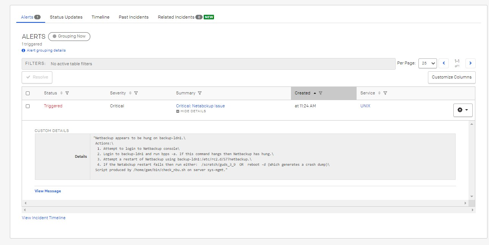

# Introduction 
This script is intended to contact the on call personnel via sms in case of an issues with a specific system identified by an automated process.

This script uses the callout rota from pagerduty.com

# Requirements

1. Access to pagerduty.com


## Getting Started
Copy the appropriate binary to directory of your choice.

My advise would to place the file Unity share so all can use and only on version needs to be maintained along with configuration file. 

# Config file example this is in JSON format:
```
{
    "unix": {
                "routing_key": "",
                "retries": "3",
                "retry_interval": "30",
                "proxy_server": ""
    },
    "oracle": {
                "routing_key": "",
                "retries": "3",
                "retry_interval": "30",
                "proxy_server": ""
    }
}
```

# Usage
```
.\pagerduty.exe --help

usage: PagerDuty events [-h] [--routing_key ROUTING_KEY] [--msg MSG]
                        [--source SOURCE] [--keyname KEYNAME]
                        [--event {TRIGGER,RESOLVE,ACKNOWLEDGE}]
                        [--details DETAILS] [--jdetails JDETAILS]
                        [--jfile JFILE]
                        [--severity {info,critical,warning,error}]
                        [--retries RETRIES] [--retry_interval {30,60,120,300}]
                        [--proxy_server PROXY_SERVER] [--cfgfile CFGFILE]
                        [--cfgfilekey CFGFILEKEY] [--version]

optional arguments:
  -h, --help            show this help message and exit
  --routing_key ROUTING_KEY
                        Routing Key
  --msg MSG             Support message (Summary)
  --source SOURCE       Server name or program name so on
  --keyname KEYNAME     Unique Key name for email matching and de-dup
  --event {TRIGGER,RESOLVE,ACKNOWLEDGE}
                        Event Type Default: TRIGGER
  --details DETAILS     Free text details example "Netbackup appears to be
                        hung on backup-ldn1.\n Actions:" [Optional]
  --jdetails JDETAILS   Json dictionary format example: "{'host': 'backup-
                        ldn1'}" [Optional]
  --jfile JFILE         Json File format example: "{'host': 'backup-ldn1'}"
                        [Optional] NOTE: jdetails takes precedence
  --severity {info,critical,warning,error}
                        Select one of the following: info, warning, error,
                        critical Default: critical
  --retries RETRIES     Number of attemps to retry
  --retry_interval {30,60,120,300}
                        Interval between retries in seconds
  --proxy_server PROXY_SERVER
                        eg. http://xxx.xxx.xxx.xxx:xxxx
  --cfgfile CFGFILE     Enter full path and file name
  --cfgfilekey CFGFILEKEY
                        Enter cfgfile key
  --version             Information Version
```

** NOTE: The command line parameters will take precedence over the config file. **

## Example 1 Trigger an alert using config file
.\pagerduty.exe --msg "Critical: Netabckup Issue" --source "test.gam.com" --keyname "ascde" --event TRIGGER --jdetails "{'host': 'backup-ldn1'}" --details "Netbackup appears to be hung on backup-ldn1.\n Actions:\n  1. Attempt to login to Netbackup console\n  2. Login to backup-ldn1 and run bpps -a. If this command hangs then Netbackup has hung. \n  3. Attempt a restart of Netbackup using backup-ldn1:/etc/rc2.d/S77netbackup.\n  4. If the Netabckup restart fails then run either:  /scratch/guds_3_9  OR  reboot -d (Which generates a crash dump)\n Script produced by /home/gam/bin/check_nbu.sh on server sys-mgmt." --cfgfile "e:\infraauto\pagerduty.cfg" --cfgfilekey "unix"

### Output
```
Trigger ascde
PagerDuty message successfully sent.
```

## Example 2 Trigger an alert not using config file
.\pagerduty.exe --routing_key "39c918b8a2af48aea61521d83dbf05cc" --msg "Critical: Netabckup Issue" --source "test.gam.com" --keyname "ascde" --event TRIGGER --jdetails "{'host': 'backup-ldn1'}" --details "Netbackup appears to be hung on backup-ldn1.\n Actions:\n  1. Attempt to login to Netbackup console\n  2. Login to backup-ldn1 and run bpps -a. If this command hangs then Netbackup has hung.\n  3. Attempt a restart of Netbackup using backup-ldn1:/etc/rc2.d/S77netbackup.\n  4. If the Netabckup restart fails then run either:  /scratch/guds_3_9  OR  reboot -d (Which generates a cra
sh dump)\n Script produced by /home/gam/bin/check_nbu.sh on server sys-mgmt." --proxy_server http://xxx.domain:9480

### Output
```
Trigger ascde
PagerDuty message successfully sent.
```

# Parameter --detail and --jdetails

You can use either or both below image demostartes what you will see in pager duty:

### Example 1 using both parameters:
In the image above 1 is the info from --jdetails and 2 is from --details


### Example 2 using --jdetails only:
]

### Example 3 using --details only:
]


[Source]()
