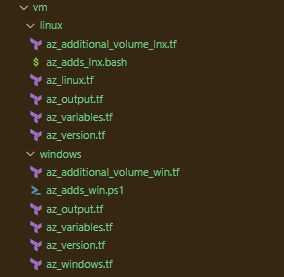

# Create VM
##Windows example: 

cd %rootdir%/InfraAzureAutomation\powershell

<span style="color:yellow"> NOTE: my root dir is C:\Deployment this is where I downloaded the source from devops.azure. </span>
 
Create config only: 
pwsh ./az_vm.ps1 -c -account TST01 -region uksouth -rg Rubrik-backup-VMs-Apps-TST -vmname AZTONYW02T -size Standard_B2s -osver WIN2019 -desc "terraform test build" -owner tony -disks 30,20 

To deploy only: 
 
<span style="color:yellow"> NOTE: this is dependent on the config being created. </span>

pwsh ./az_vm.ps1 -d -account TST01 -region uksouth -vmname AZTONYW02T 

To config and deploy in one hit: 

pwsh ./az_vm.ps1 -c –d -account TST01 -region uksouth -rg Rubrik-backup-VMs-Apps-TST -vmname AZTONYW02T -size Standard_B2s -osver WIN2019 -desc "terraform test build" -owner tony -disks 30,20 

<span style="color:green"> For Linux we just replace –osver value with the word "LINUX" </span>

## Below list of the VM modules found in %basedir%\InfraAutomationScripts\Terraform\Azure\modules\vm 



## VM templates found in %basedir%\InfraAutomationScripts\Terraform\Azure\templates 


VM are stored in devops Azure

## HELP
```
PS C:\Deployment\InfraAzureAutomation\powershell> .\az_vm.ps1 -help
Creating Linux or Windows VM's:

    -c       --> Create configuration for VM
    -d       --> Deploy configuration for VM
    -nb      --> Use local filesystem for state files
    -f       --> Force deployment
    -tfrepo  --> Build storage account for state files in the cloud
    -account --> Account name
    -vmname  --> Virtual machine name
    -region  --> VM location
    -rg      --> VM resource group name
    -size    --> VM instance type
    -disks   --> Aditional disk/s sizes (if multiple separated by comma)
    -osver   --> Operating system [LINUX|WIN2019]
    -owner   --> VM owner
    -desc    --> Description
    -az      --> Availability zone [PRIMARY|SECONDARY]
    -backup  --> RUBRIK SLA DOMAIN
    -adjoin  --> Select to join server to AD
    -destroy --> destroy VM
    -regenerate --> Recreate config file
    -help    --> Help usage

To create new windows VM configuration with cloud back end example:
  az_vm.ps1 -c -account TST01 -region uksouth -rg Rubrik-backup-VMs-Apps-TST -vmname AZTONYW02T -size Standard_B2s -osver WIN2019 -desc "terraform test build" -owner tony -disks 30,20

To create new LINUX VM configuration with cloud back end example:
  az_vm.ps1 -c -account TST01 -region uksouth -rg Rubrik-backup-VMs-Apps-TST -vmname AZTONYL03T -size Standard_B2s -osver LINUX -desc "terraform test build" -owner tony -disks 30,20

To deploy VM configuration:
  az_vm.ps1 -d -account TST01 -region uksouth -vmname AZTONYW02T

To configure and deploy new VM
  az_vm.ps1 -c -d -account TST01 -region uksouth -rg Rubrik-backup-VMs-Apps-TST -vmname AZTONYW02T -size Standard_B2s -osver WIN2019 -desc "terraform test build" -owner tony -disks 30,20

  For any of the above to use local state files add option -nb

To create TF backup storage on cloud:
  az_vm.ps1 -tfrepo -account tst01 -nb
```
